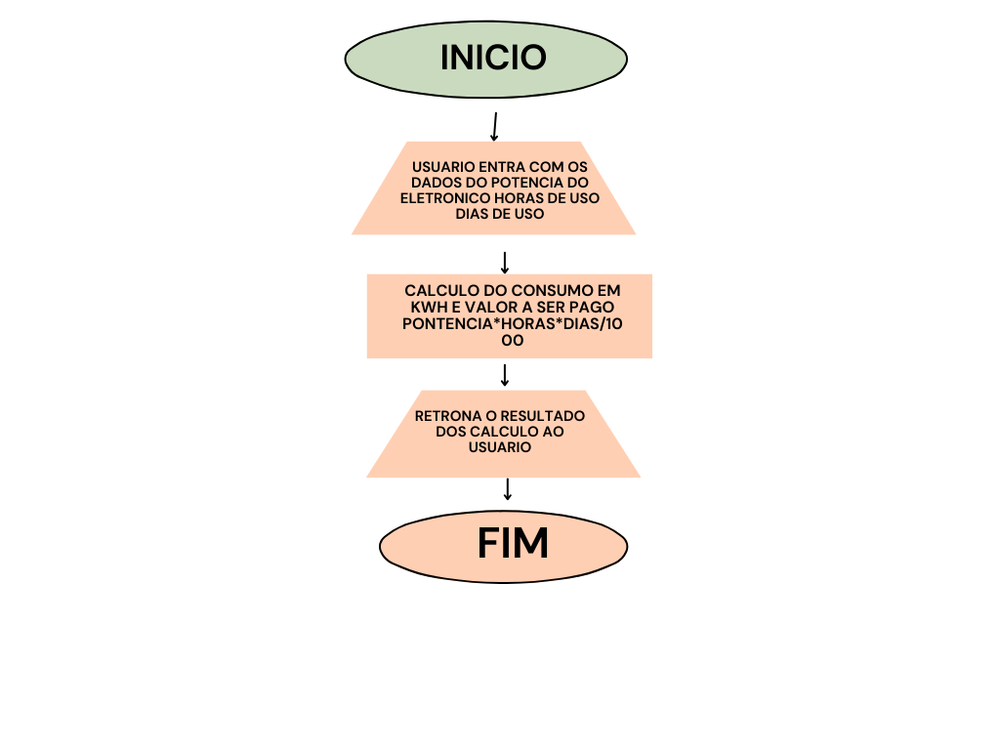

# 🚀 consumo de energia e valor a ser pago pelo usuario 

> Um projeto academico para aprofundamento em python

## 💻 Sobre
Esse projeto tem como finalidade de calcular o comsumo de energia eletrica de um eletronico e infromar valor total consulmido em kwh, o total em reais no mes  

## ✨ Fluxograma


## 🛠 Tecnologias
As principais ferramentas usadas no projeto:
* **Linguagem:** [Python]

## 🚀 Como Rodar
Siga os passos abaixo para ter uma cópia do projeto rodando na sua 
máquina:

### Pré-requisitos
* vscode
* Python 3.10 ou superior instalado
* Git instalado

### Instalação
1. Clone o repositório:
   ```bash
   git clone [https://github.com/usuario/projeto.git](https://github.com/usuario/projeto.git)

2. Acesse a pasta do projeto:

   ```bash
    cd nome-do-seu-repositorio
   
3. Execute o programa:

   ```bash
    python main.py

## 👩‍💻👨‍💻 Autores
Informe:
- johnatan – Desenvolvimento Web e Mobile – Python basico.
